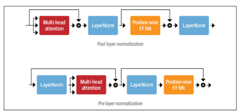

### Transformers

The most basic object in the [Transformers library](huggingface link) is the pipeline() function. It connects a model with its necessary preprocessing and processing steps, allowing users to directly input any text and get an intelligible answer.
By default, the pipeline selects a particular pretrained model that has been fine-tuned for the task specified.
[Available pipelines](https://huggingface.co/transformers/main_classes/pipelines.html)

On the [hub](hugging face hub link), you can filter out the models you want to see using the task tag, once you select a model, you will see that there is a widget enabling you to try it directly online, this way, you can quickly test the model's capabilities before downloading it.

When the task specified is fill-mask, the model fills in the special `<mask>` word, which is often referred to as a mask token. mask filling models may have different mask tokens so it's always good to verify the proper mask word when using a particular model. One way to do this is by looking at the mask word used in the widget.

Transformers can be grouped into 3 categories:

1. GPT-like(also called auto-regressive\* Transformer models)
2. BERT-like(also called auto-encoding\* Transformer models)
3. BART/T5-like(also called sequence-to-sequence Transformer models)

Transformers are language models, this means they have been trained on large amounts of raw text in a self-supervised fashion. Self-supervised learning is a type of training in which the objective is automatically computed from the inputs of the model meaning humans are not needed to label the data.
This type of model develops a statistical understanding of the language it has been trained on, but it is not very useful for **specific** practical tasks. Because of this, the general pretrained model then goes through transfer learning. During the transfer learning process, the model is fine-tuned in a supervised way -- that is, using human-annotated labels -- on a given task.

Transformers are big models, apart from a few outliers(like DistilBERT), the general strategy to achieve better performance is by increasing the models' sizes as well as the amount of data they are pretrained on. Unfortunately, training a large model requires large amounts of data and this may become very costly in terms of time and compute resources, translating further to environmental impact.
Enviromental impact depends on several things include:

- Type of energy(renewable vs non-renewable, renewable emit the least or no amount of carbon)
- Training time(The longer a model is trained, the higher it's propensity for carbon emmisions)
- Hardware used(Utilizing efficient gpus properly result in lower carbon footprint)
  Minimizing carbon footprint
- Choose the right instance where carbon emission will be minimal.
- Use pretrained models when they're available(then fine-tune them as required)
- Start with smaller experiments and debugging(start small so you don't realize 60hrs into your training that there is an error in your code)
- Use Random Search instead of Grid Search(The footprint of running lots of trials to get the best hyperparameters would be higher than that incurred from actually training the model).

Imagine if each time a research team wanted to train a model, it did so from scratch, this would lead to huge, unnecessary global costs, that is why sharing language models is paramount: sharing the trained weights and building on top of already trained weights reduces the overall compute cost and carbon footprint of the community.

#### Transfer Learning

- Pretraining is the act of training a model from scratch: The weights are randomly initialized and the training starts without any prior knowledge. For large language models, pretraining is usually done on very large amounts of data and may take up several weeks.
- Fine-tuning, on the other hand, is the training done after a model has been pretrained. To perform fine-tuning, you first acquire a pretrained language model, then perform additional training with a dataset specific to your task. This is usful for a couple of reasons:

1. The pretrained model was already trained on a dataset that has some similarities with the fine-tuning dataset. The fine-tuning process is thus able to take advantage of the knowledge acquired by the initial model during pretraining(for instance, with NLP problems, the pretrained model will have some kind of statistical understanding of the language you are using for your task).
2. Since the pretrained model was already trained on lots of data, the fine-tuning requires way less data to get decent results.
3. For the same reason, the amount of time and resources needed to get good results are much lower.
   Fine-tuning a model therefore has lower time, data, financial and environmental costs. It is also quicker and easier to iterate over different fine-tuning schemes as the training is less constraining than a full pretraining. This process will also achieve better results than training from scratch(unless you have lots of data) which is why you should always try to leverage a pretrained model - one as close as possible to the task you have at hand - and fine tune it.
   
Also, through transfer learning, transformer models can be feature extractors: Using a transformer as a feature extractor is fairly simple, freeze the body's weights during training and use the hidden states as features for the classifier.

### The Transformer Architecture

Transformer models are primarily composed of two blocks:

- Encoder: The encoder receives an input and builds a representation of it(it's features) often called the context or hidden state. This means that the model is optimized to acquire understanding from the input.
- Decoder: The decoder uses the encoders representation(called the context or hidden state) along with other inputs to generate a target sequence. This means the model is optimized for generating outputs.
  Each of these parts can be used independently, depending on the task:
- Encoder-only models: Good for tasks that require understanding of the input, such as sentence classification and named entity recognition. 
- Decoder-only models: Good for generative tasks such as text generation.
- Encoder-decoder models or sequence-to-sequence models: Good for generative tasts that require an input, such as translation or summarization.

#### Attention Layers

A key feature of Transformer models is that they are built with special layers called **attention layers**. This layer tells the model to pay specific attention to certain words in the sentence you passed it (and more or less ignore the others) when dealing with the representaion of each word.

To put this into context, consider the task of translating text from English to French. Given the input “You like this course”, a translation model will need to also attend to the adjacent word “You” to get the proper translation for the word “like”, because in French the verb “like” is conjugated differently depending on the subject. The rest of the sentence, however, is not useful for the translation of that word. In the same vein, when translating “this” the model will also need to pay attention to the word “course”, because “this” translates differently depending on whether the associated noun is masculine or feminine. Again, the other words in the sentence will not matter for the translation of “this”. With more complex sentences (and more complex grammar rules), the model would need to pay special attention to words that might appear farther away in the sentence to properly translate each word.
The same concept applies to any task associated with natural language: a word by itself has a meaning, but that meaning is deeply affected by the context, which can be any other word (or words) before or after the word being studied.

#### The original transformer architecture

The transformer architecture was originally designed for translation, during training, the encoder receives inputs(sentences) in a certain language, while the decoder receives the same sentences in the desired target language. In the encoder, the attention layers can use all the words in a sentence since the translation of a given word can be dependent on what is after as well as before it in the sentence.The decoder, however, works sequentially and can only pay attention to the words in the sentence that it has already translated(so, only the words before the word currently being generated). For example, when the decoder has already predicted the first 3 words of the translated target, it uses them and the inputs of the encoder to try to predict the fourth word.

To speed things up during training(when the model has access to target sentences), the decoder is fed the whole target, but it is not allowed to use future words(if it has access to the word at position 2 when trying to predict the word at position 2, the problem would not be very hard). For instance, when trying to predict the fourth word, the attention layer will only have access to the words in position 1 to 3.
An _attention mask_ can also be used in the encoder/decoder to prevent the model from paying attention to some special words, for instance, the special padding word used to make all the inputs the same length when batching together sentences.

#### Encoder Models

An encoder is a sequence to vector network. Supposing the words "Welcome to NYC" were passed to it, it will output a numerical representation for each word, each output is sequence of numbers representing the given word. This numerical representation can be called a feature-vector and is made up of a vector of values for each word of the initial sequence. The dimension of the vector is defined by the architecture of the model. However, each word in the initial sequence affects every other word's representation, this is called the context/hidden state. So each representation is a value of a word given the context. The network does this thanks to the self attention\* mechanism. Encoders are very powerful at extract meaningful information about a sequence. 
Encoder models are often characterized as having "bi-directional" attention, and are often called _auto-encoding models_. Bidirectional in the sense that it considers words before and after the one it focuses on in order to extract meaningful information from the given sentence.
The pretraining of these models usually revolves around somehow corrupting a given sentence(for instance, by masking random words in it) and tasking the model with finding or reconstructing the initial sentence.
Encoder models are best suited for tasks requiring an understanding of the full sentence, such as sentence classification, named entity recognition and extractive question answering.
Examples:

- ALBERT, BERT, ELECTRA, DistilBERT, RoBERTa
Bert is pretrained with 2 objectives of predicting masked tokens in texts and determining if one text passage is likely to follow another. The former is called masked language modeling(MLM) and the latter next sentence prediction(NSP)
Even though BERT delivers great results, its size can make it tricky to deploy in environments where low latencies are required. By using a technique known as knowledge distillation during pretraining, DistilBERT achieves 97% of BERT's performance while using 40% less memory and being 60% faster.

#### Decoder models

At each stage of a decoding process, for a given word, the attention layers can only access the words positioned before it in the sentence. As a result, these models are often called auto-regressive models. Focusing on only words positioned before it is due to the masked self-attention mechanism. Decoders only have access to one directional context, the left or right context, hence they are unidirectional. The masked self attention layer takes care of hiding values from the direction not considered.
The pretraining of decoder models usually revolves around predicting the next word in the sentence and are best suited for tasks involving text generation.
Decoder models can also be referred to as causal language models\*
Examples:

- CTRL, GPT, GPT-2, TransformerXL
Models like GPT-2 can continue an input sequence(also called a prompt). However, the user has little control over the style of the generated sequence. The Conditional Transformer Language(CTRL) model addresses this issue by adding "control tokens" at the beginning of the sequence. These allow the style of the generated text to be controlled, which allows for diverse generation.

#### Transformer models(sequence to sequence models)

These are encoder-decoder models using both parts of the transformer architecture.
Sequence-to-sequence models are best suited for tasks revolving around generating new sentences depending on a given input, such as summarization, translation or generative question answering.
Examples:

- 
, ProphetNet, mT5, M2M100, mBART, Marian, T5, Pegasius.
BART combines the pretraining procedures of BERT and GPT within the encoder-decoder architecture. The input sequences undergo one of several possible transformations, from simple masking to sentence permutation, token deletion and document rotation. These modified inputs are passed through the encoder and the decoder has to reconstruct the original texts. This makes the model more flexible as it is possible to use it for both NLU and NLG tasks, and it achieves state of the art performance on both.
  Also, you can load an encoder and a decoder inside an encoder-decoder model, you can choose to use specific models for each depending on the task you are working on

#### Bias and Limitations

One limitaions of using a pretrained model or a fine-tuned version in production is that, to enable pretraining on large amounts of data, researchers often scrape all the content they can find, taking the best as well as the worst of what is available on the internet. When you use them, you have to keep it in the back of your mind that the original model you are using could very easily generate sexist, racist or homophobic content. Fine-tuning the model on your data won't make this intrinsic bias disappear.

### Pipeline() Function

A pipeline consists of 3 stages: Tokenizer -> Model -> Postprocessing.
Tokenizers take care of the first and last processing steps, handling the conversion from text to numerical inputs for the neural network, and the conversion back to text when it is needed.

The raw text is converted into numbers the model can make sense using tokenizers, these numbers serve as input to the model which further outputs logits to the postprocessing step which further transforms these logits into labels(predictions).

The tokenization process have several steps, first, the raw text is split into small chunks called tokens. The tokenizer will proceed to adding special tokens such aas [SEP], [CLS] and then match each token to its unique Id.
If the sentences fed to the tokenizer are not the same size, you set it's paddings to True so the shorter text is padded up to the required length. truncated is set to true to ensure any text longer than maximum is truncated.

For the modeling process, we can use TFAutoModel which only instantiates the body of the model(i.e part of the model that is left once the pretraining head is removed). This will output a high dimensional tensor that is a representation of the sentences passed but not directly useful for the task. The outputs shape is in the form of (number of sentences, tokens for each of the sentenses, dimension of the hidden size of model).

The output from the modeling process(called logits - raw, unnormalized scores) is fed into the postprocessing stage, which converts the logits to probabilities(through a SoftMax layer - tf.math.softmax. The softmax function is used cause it applies a lower and upper bound to the outputs so that they're understandable, the total sum of the output is 1, resulting in a possible probabilistic interpretation). The `model.config.id2label` config matches the index of each probability to the label that corresponds with it.
For modeling, there are many different architectures available in the hugging face Transformers library, with each one designed around tackling a specific task. Included below are some of them:
*Model (retrieve the hidden states)
*ForCausalLM
*ForMaskedLM
*ForMultipleChoice
*ForQuestionAnswering
*ForSequenceClassification
\*ForTokenClassification

`from transformers import AutoTokenizer(for tokenization), TFAutoModel(for modeling)`

### Models

The TFAutoModel class is handy when you want to instantiate any model from a checkpoint. It is a clever wrapper over a wide variety of models available in the library and can automatically guess the appropriate model architecture for the passed checkpoint and then instantiates a model with this architecture. However, if you know the type of model you want to use, you can use the class that defines its architecture directly. Eg, for the BERT model, you can use TFBertModel, and BertConfig(To initialize a BERT model, load its configuration object which contains many attributes that are used to build the model).
While creating a model with configurations can be used, it's output will be gibberish as it needs to be trained first. One can train the model from scratch on the task at hand but this will require a long time, a lot of data, and some environmental impact, to avoid unnecessary and duplicated effort, it's imperative to be able to share and reuse models that have already been trained, this can be done using the model's `from_pretrained` method.

### Tokenizers
#### The tokenizer pipeline
The tokenization process usually consists of four steps: Normalization, Pretokenization, Tokenizer Model, Postprocessing.
- Normalization: This step corresponds to the set of operations one applies to a raw string to make it "cleaner". Common operations include stripping whitespace and removing accented characters. Unicode normalization is another common normalization operation applied by many tokenizers to deal with the fact that there often exist various ways to write the same character. Another example of normalization is lowercasing, If the model is expected to only accept and use lowercase characters, this technique can be used to reduce the size of the vocabulary it requires. 
- Pretokenization: This step splits a text into smaller objects that give an upper bound to what your tokens will be at the end of training. A good way to think of this is that the pretokenizer will split your text into “words,” and your final tokens will be parts of those words. For the languages that allow this, strings can typically be split into words on whitespace and punctuation. However, in languages like chinese, japanese or korean, grouping symbols in sematic units can be a nondeterministic operation with several equally valid groups. In this case, it might be best not to pretokenize the text and instead use a language specific library for pretokenization.
- Tokenizer Model: Once the input texts are normalized and pretokenized, the tokenizer applies a subword splitting model on the words. This is the part of the pipeline that needs to be trained on your corpus (or that has been trained if you are using a pre‐
trained tokenizer). The role of the model is to split the words into subwords to reduce the size of the vocabulary and try to reduce the number of out-of-vocabulary tokens. Several subword tokenization algorithms exist, including BPE, Unigram, and WordPiece. Note that at this point we no longer have a list of strings but a list of integers (input IDs)
- Postprocessing: This is the last step of the tokenization pipeline, in which some additional transformations can be applied on the list of tokens—for instance, adding special tokens at the beginning or end of the input sequence of token indices. This sequence can then be fed to the model.

Types of Tokenizers:
- Word based tokenizers: Splits raw data into words. With this type of tokenization, we can end up wit a pretty large "vocabularies", where vocabulary is the total number of independent tokens that we have in our corpus. Each word gets assigned an ID, starting from 0 and going up to the size of the vocabulary. The model uses these IDs to identify each word. If you want to completely cover a language with a word based tokenizer, you'll need to have an identifier for each word in the language, which will generate huge amounts of tokens. Also, words like "dog" are represented differently from words like "dogs" and the model will initially have no way of knowing that "dog" and "dogs" are similar; it will identify the two words as unrelated. The same applies to words like "run" and "running" which the model will not see as being similar initially. A custom token - known as the unknown token [UNK] is used to represent words that are not in the vocabulary and it's generally a bad sign if you see that the tokenizer is producing a lot of these tokens, as it wasn't able to retrieve a sensible representation of a word and you're losing information along the way. The goal, when crafting the vocabulary, is to do it in a way that the tokenizer tokenizes as few words as possible into the unknown token. One way to do this is by using character based tokenizer.

- Character based tokenizers split the text into characters rather than words. This has two primary benefits:

1. The vocabulary is much smaller.
2. There are much fewer out-of-vocabulary tokens, since every word can be built from characters.
   Since the representation is now based on characters rather than words, intuitively, it is less meaningful: each character doesn't mean a lot on its own as is with words, however, this again differs according to a language; in chinese, for example, each character carries more information than a character in a latin language. Another thing to consider is that we'll end up with a very large amount of tokens to be processed by our model: whereas a word would only be a single token with a word-based tokenizer, it can easily turn into 10 or more tokens when converted into characters. To get the best of both worlds, we can use subword tokenization which combines the two approaches.

- Subword tokenization: This tokenizer algorithms rely on the principle that frequently used words should not be split into smaller subwords but rare words should be decomposed into meaningful subwords. For instance, "annoyingly" might be considered a rare word and could be decomposed into "annoying" and "ly". These are both likely to appear more frequently as standalone subwords while at the same time, the meaning of "annoyingly" is kept by the composite meaning of "annoying" and "ly".

Other methods are:

- Byte-level BPE ( used in GPT-2) - WordPiece(used in BERT) - SentencePiece or Unigram, as used in several multilingual models.

- SentencePiece: This tokenizer is based on a type of subword segmentation called Unigram and encodes each input text as a sequence of Unicode characters. This last feature is especially useful for multilingual corpora since it allows SentencePiece to be agnostic about accents, punctuation, and the fact that many languages, like japanese, do not have whitespace characters. Another special feature is that whitespace is assigned the unicode symbol U+2581, or the _ characher, also called the lower one quarter block character. This enables SentencePiece to detokenize a sequence without ambiguities or without relying on language-specific pretokenizers. 

### Encoding

Translating text to numbers is known as encoding. This is done in a two-step process: the tokenization, followed by the conversion to input IDs. There are multiple rules that can govern the process of tokenization, for this reason, one needs to instantiate the tokenizer using the name of the model, to make sure we use the same rules that were used when the model was pretrained. To convert tokens into number representations, the tokenizer's vocabulary is used, which is the part we download when we instantiate it with the `from_pretrained()` method.

### Handling Multiple Sequences

Batching is the act of sending multiple sentences through the model, all at once. When you try to batch together 2 or more sentences, they may be of different lengths, however, tensors need to be of rectangular shape so you may not be able to convert the list of input IDs into a tensor directly. Inputs are usually padded to work around this problem. This makes sure all sentences have the same required length by adding a special word called the padding token to the sentences with fewer values. However, one key feature of transformer models is attention layers which contextualize each token, as such, they will take into account the padding tokens since they attend to all the tokens of a sequence. To get the same result as when passing individual sentences of different lengths through the model or when passing a batch with the same sentences and padding applied, we need to tell those attention layers to ignore the padding tokens, this is done using an attention mask.

### Attention masks.

These are tensors with the exact same shape as the input IDs tensor, filled with 0s and 1s: 1s indicate the corresponding tokens should be attended to, 0s indicate the corresponding tokens should not be attended to(i.e they should be ignored by the attention layers of the model).

### Longer Sequences.

With transformer models, there is a limit to the lengths of the sequence we can pass the models, most models handle sequences of up to 512 or 1024 tokens, and will crash when asked to process longer sequences. To solve this issue, we can either use a model with a longer supported sequence length or truncate the sequences. Models that support very long sequences, for example, include [longformer](https://huggingface.co/transformers/model_doc/longformer.html) and [LED](https://huggi ngface.co/transformers/model_doc/led.html). When not using these models, it is recommended to truncate the sequences by specifying the max_sequence_length parameter of the model.

Some models are pretrained with special words, as such, during tokenization, these words need to be added too to the inputs to get the same results for inference. the tokenizer takes care of adding these words for us.

### The Encoder
A transformer's encoder consists of many encoder layers stacked next to each other, each layer receives a sequence of embeddings and feeds them through the following sublayers:
- A multi-head self attention layer
- A fully connected feed-forward layer that is applied to each input embedding.
The output embeddings of each encoder layer have the same size as the inputs, and the main role of the encoder stack is to "update" the input embeddings to produce representations that encode some contextual information in the sequence. 
Each of these sublayers also use **skip connections** and **layer normalization** which are standard tricks to train deep neural networks effectively(?).

#### Self Attention
Attention is a mechanism that allows neural networks to assign a different amount of weight or "attention" to each element in a sequence based on their relevance to the current context. The "self" part of self-attention emphasizes the idea that each position is attending to itself as well as to other positions in the sequence. By contrast, the attention mechanism associated with recurrent models involves computing the relevance of each encoder hidden state to the decoder hidden state at a given decoding timestep.

The main idea behind self-attention is that instead of using a fixed embedding for each token, we can use the whole sequence to compute the weighted average of each embedding. This can be formulated as follows: given a sequence of token embeddings $X_1, ..., X_n$, self attention produces a sequence of new embeddings $X_1^{\prime}, ..., X_n^{\prime}$ where each  $X_1^{\prime}$ is a linear combination of all the  $X_j$.

$$X_i^{\prime} = \sum_{j=1}^n w_{ji} X_j$$

The coeficients $w_{ji}$ are called attention weights and are normalized so that  $\sum_{j} w_{ji} = 1$.

To see why averaging the token embeddings might be a good idea, consider what comes to mind when you see the word “flies”. You might think of annoying insects, but if you were given more context, like “time flies like an arrow”, then you would realize that “flies” refers to the verb instead. Similarly, we can create a representation for “flies” that incorporates this context by combining all the token embeddings in different proportions, perhaps by assigning a larger weight w_{ji} to the token embeddings for “time” and “arrow”. Embeddings that are generated in this way are called contextualized embeddings.

Self-attention involves three main components: keys, values, and queries. The key/value/query concept is analogous to information retrieval systems, eg, when you search for videos on Youtube, the search engine will map your query(text in the search bar) against a set of keys(video title, description etc) associated with candidate videos in their database, then present you the best matched videos(values). In the context of machine learning, query vectors represent a position's role or its significance in the context of other positions, key vectors represent what's important or relevant at a position and value vectors represent the content or features at a position(?)
The most common way of implementing the self-attention layer is _scaled dot-product attention_ and this requires 4 steps:
1. Project each token embedding into the 3 main components(vectors): query, key and value.
2. **Compute attention scores:** We determine how much the query and key vectors relate to each other using a similarity function, this similarity function is the dot product, computed efficiently using matrix multiplication of the embeddings. Queries and keys that are similar will have a large dot product while those that don't share much in common will have little to no overlap. The outputs from this step are called the attention scores and for a sequence with n input tokens, there is a corresponding n x n matrix of attention scores(For a given position, say i, the attention score between position i and every other position j is the _dot product of the query vector at position i_ and the _key vector at position j_.
3. **Compute attention weights:** Dot products can, in general, produce arbitrarily large numbers which can destabilize the training process. To handle this, the attention scores are first multiplied by a scaling factor to *normalize their variance* and then further *normalized with a softmax to ensure all the column values sum to 1.* The resulting n x n matrix now contains all the attention weights w_{ji}. My way to understand this is that attention weights are _scaled attentions scores_
4. **Update the token embeddings:** Once the attention weights are computed, we multiply them by the value vector $v_1, ..., v_n$ to obtain an updated representation for embeddings $$X_i^{\prime} = \sum_{j} w_{ji} v_j$$

##### Multi-headed attention
Attention mechanisms with equal query and key vectors will assign a very large score to **identical words** in the context, and in particular to the current word itself: the dot product of a query with itself is always 1. But in practice, the meaning of a word will be better informed by **complementary words** in the context than by identical words, eg the meaning of "flies" is better defined by incorporating information from "time" and "arrow" than by another mention of "flies". To address the issue of overemphasizing identical words, the model needs to create different sets of vectors for the query, key and value of a token. This is achieved by applying 3 different linear transformations to each embedding, resulting in separate vectors for query, key, and value with each transformation having its own set of learnable parameters.

Its also beneficial to have multiple sets of linear projections, each one representing a so-called "attention head". Each attention head focuses on different semantic aspects of the sequence. **The reason for having multiple heads is that the softmax of one head tends to focus on mostly one aspect of similarity.** By having several heads, the model can simultaneously focus on different aspects, allowing it to learn diverse patterns and relationships in the data. For instance, one head can focus on subject-verb interaction, whereas another finds nearby adjectives. We don't handcraft these relations into the model and they are fully learned from the data. This can be likened to filters in CNNs where one filter can be responsible for detecting faces and another one finds wheels of cars in images.

#### The Feed Forward Layer
This is just a simple two-layer fully connected neural network(consists of two linear transformations with a non-linear activation function in between), but with a twist: instead of processing the whole sequence of embeddings as a single vector, it processes each embedding independently. For this reason, it is often referred to as a _position-wise feed-forward layer_. _position-wise_ meaning that the same operation is applied independently to each position in the sequence. It may also be referred to as a one-dimensional convolution with a kernel size of 1.
A rule of thumb is for the hidden size of the first layer to be four times the size of the embeddings, and a GELU activation function is commonly used. This is where most of the capacity(to model interactions and dependencies beyond what self attention captures) and memorization is hypothesized to happen and it's the part that is most often scaled when scaling up models. The structure can be summarized as follows:
- Linear Transformation 1: $FFN_1(x) = GELU(W_1x + b_1)$ \
- Linear Transformation 2: $FFN_2(FFN_1(x)) = W_2  FFN_1(x) + b_2$ \
where W_1, b_1, W_2, b_2 are learnable parameters, and GELU represent Gaussian Error Linear Unit activation function. The operations in the feed-forward layer are applied independently to each position in the sequence thus the learnable parameters are not shared across positions allowing the model to adapt to different patterns at different positions.

--- Start of diversion ---

Skip connections pass a tensor to the next layer of the model without processing and add it to the processed tensor, in essence, they enable the flow of information from the input directly to the output of a particular layer, allowing the gradient to bypass the layer during back propagation - a way to mitigate vanishing gradient and eases training by providing a shortcut for gradient flow. They are typically represented as Input + Output. The input to a layer is directly added to the ouput of the layer. Mathematically, if $x$ is the input and $F(x)$ is the transformation performed by the layer, the skip connection is $x + F(x)$. They are often applied around sub-layers, such as the self-attention mechanism or the position-wise feed-forward network to improve the model's ability to learn from the input data

--- End of diversion ---

Often, a layer normalization step is applied before the feed-forward layer to normalize the inputs to have zero mean and unity variance. This helps stabilize the learning process and improves the convergence of the model. some choices on where to place layer normalization in the encoder or decoder layers of a transformer are as follows:-
- Post layer normalization: (This is the arrangement used in the Transformer paper). It places layer normalization in between the skip connections but is tricky to train from scratch as the gradients can diverge. For this reason, the concept of learning rate warm up is applied which is where the learning rate is gradually increased from a small value to some maximum value during training. (Applied after the skip connections)
- Pre layer normalization: Most common arrangement. It places layer normalization within the span of the skip connections and tends to be much more stable during training. It does not require any learning rate warm up. (Applied before the skip connections)

#### Positional Embeddings
Unlike RNNs or CNNs, transformers do not inherently have an understanding of the order or position of tokens in a sequence because they process tokens in parallel hence positional embeddings are used to provide the model with information about the positions of tokens in a sequence. These positional embeddings are based on a simple but very effective idea: augment the token embeddings with a position dependent pattern of values arranged in a vector. If the pattern is characteristic(distinct) for each position, the attention heads and feed-forward layers in each stack can learn to incorporate positional information into their transformations.
One popular approach to positional embedding is to use a learnable pattern, especially when the pretraining dataset is sufficiently large. This works exactly the same way as the token embeddings but using the position index instead of the token ID as input. With this approach, an efficient way of encoding the positions of tokens is learned during pretraining. 
Other Approaches to Positional embedding include:(?)
- Absolute Positional Representations: Transformer models can use static patterns consisting of modulated sine and cosine signals to encode the positions of the tokens. This works especially well when there are not large volumes of data available.
- Relative Positional Representations: Although absolute positions are important, one can argue that when computing an embedding, the surrounding tokens are most important. Relative positional representations follow that intuition and encode the relative positions between tokens. This cannot be setup by just introducing a new relative embedding layer at the beginning, since the relative embedding changes for each token depending on where from the sequence we are attending to it. Instead, the attention mechanism itself is modified with additional terms that take the relative position between tokens into accounts. Models like DeBERTa use such representations.
- Rotary Position Embeddings: By combining the idea of absolute and relative representations, rotary position embeddings achieve excellent results on many tasks. GPT-Neo is an example of this model.

**Transformer models are usually divided into a task-independent body and a task specific head.**

### The Decoder
The main difference between the decoder and encoder is that the decoder has two attention sublayers:
1. Masked Multi-head self-attention layer: This ensures that the tokens we generate at each timestep are only based on the past outputs and the current token being predicted. Without this, the decoder could cheat during training by simply copying the target translation; masking the inputs ensures the task is not trivial.

2. Encoder-decoder attention layer: Performs multi-head attention over the output key and value vectors of the encoder stack, with the intermediate representations of the decoder acting as the queries(unlike the self attention layer, the key and query vectors in encoder-decoder attention can have different lengths. This is because the encoder and decoder will generally involve sequences of differing length. As a result, the matrix of attention scores in this layer is rectangular and not square.) This way, the encoder-decoder attention layer learns how to relate tokens from 2 different sequences, such as two different languages. The decoder has access to the encoder keys and values in each block.

Dense in the context of embeddings means that each entry in the embeddings contains a nonzero value. In contrast, the one-hot encodings are sparse, since all entries except one are zero.

#### - Things to read more on
  SentencePiece
  WordPiece
  Model Head: An additional component, usually made up of one or a few layers, to convert the transformer predictions to a task-specific output.
  Hidden state.
  Sentences labeled as - (?)
  DeBERTa - Fist model(as an ensemble) to beat the human baseline on the SuperGLUE benchmark
  GLUE benchmark
Things labeled (?) could also mean things i don't totally understand and should checkout some time later.
   InferKit, Write with Transformer, AI Dungeon and Google's Meena
  
  
#### Useful Tools
[BertViz for Jupyter](https://github.com/jessevig/bertviz): Provides several functions that can be used to visualize different aspects of attention in transformer models.