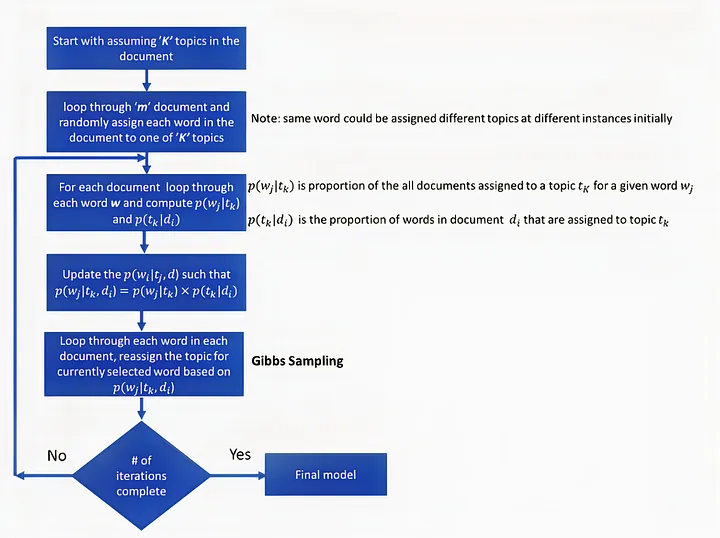
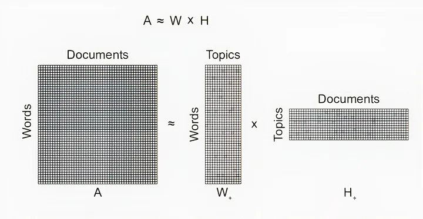
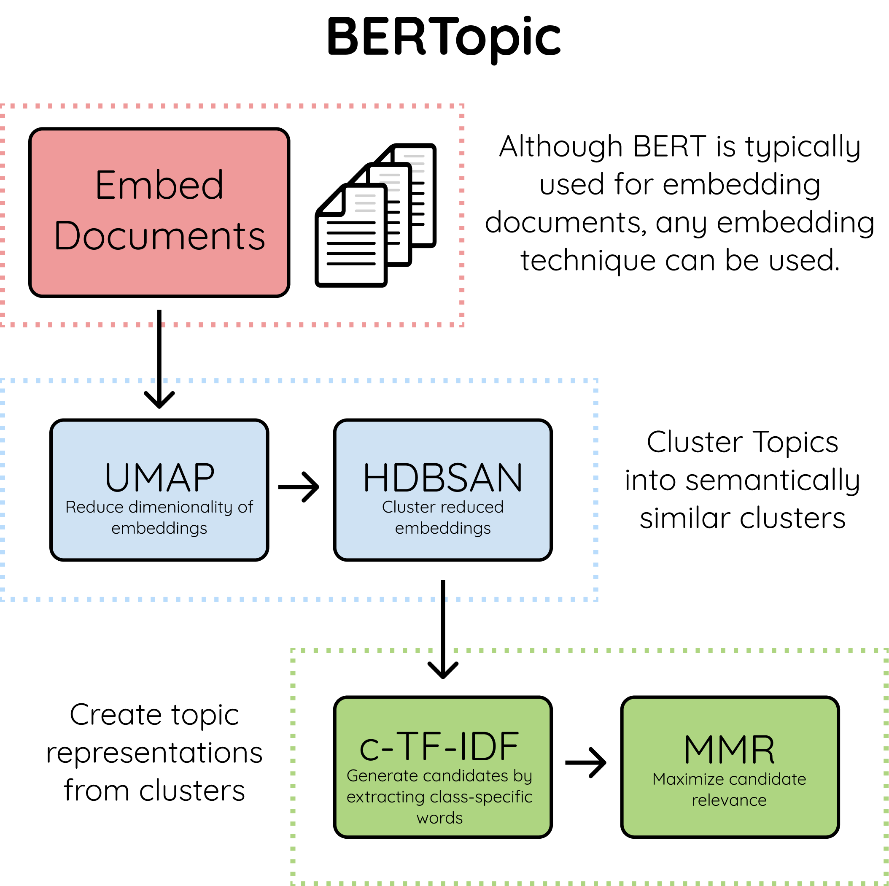
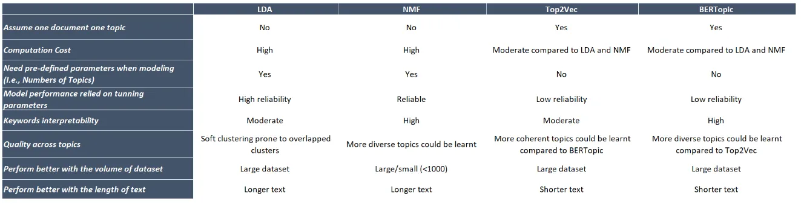

### Notes on Topic Modeling

#### Overview
Simply by communicating and conducting daily activities such as communicating through email or text, or documenting systems and preparing reports, businesses around the world produce billions of pages of text data daily. Far more text than any one human can comprehend or track. Topic modeling provides a way to organize, understand and summarize these large collections of text data quickly and in a way that leads to comprehension and insight, enabling users to grasp the main themes and ideas present in the data without having to read each individual document. It does this through the analysis of semantic structures within documents to identify common themes and provide an adequate cluster. E.g., a topic modeling algorithm could identify whether incoming documents are contracts, invoices, complaints or more based on their contents(A document on, say, machine learning is more likely to use words like "gradient" and "embedding" compared to a document about baking bread.

#### Applications
With Topic Modeling, users can analyze customer reviews, explore research papers, or categorize news articles with ease, making it an essential tool for anyone looking to extract meaningful information from their text data.

- Content Analysis: Analyzing news articles, social media posts, or customer reviews to identify trends and sentiments.
- Document Clustering: Grouping documents based on their topic distributions for easier navigation and search.
- Information Retrieval: Enhancing search and recommendation systems by enabling topic-based retrieval(Search engines optimize their search results by capturing topics of millions of web pages and relate them to customers’ search intention, and social media businesses personalize their content based on the topics of each customer’s interest)
- Trend Analysis: By applying topic modeling to text data over time, researchers can identify emerging trends, track the evolution of topics, and gain insights into how certain themes develop and change.
- Anomaly Detection: Identifying documents that do not fit well into any discovered topics.

### Topic Modeling Techniques
1. Latent Semantic Analysis(LSA): LSA is based on the principle that words with similar meanings will appear in similar documents. It applies this principle by constructing a term-document matrix and then uses Singular Value Decomposition(SVD) to reduce dimensionality while preserving the similarity structure among documents. To determine the similarity between documents, cosine similarity is the used. 

2. Latent Dirichlet Analysis(LDA): This uses Dirichlet distributions to represent documents as distributions of topics and topics as distributions of words based on their frequency in the corpus. This is based on it's consideration of documents as a mixture of topics and topics as a mixture of words. When analyzing multiple documents, it treats them as having similar topics with different distributions. E.g., Document A may have "10% Topic Y and 90% Topic Z" while document B may have "40% Topic Y and 60% Topic Z." It further breaks down topics into words, assuming that multiple topics may have common words. In the first iteration of the algorithm, each word in each document is randomly assigned to a topic. To improve upon this random assignment, the probability of a topic "t" given a document "d"(P(t|d)) and the probability of a word "w" given a topic "t"(P(w|t)) are calculated. Each word is then reassigned to a new topic based on the probability that topic "t" generated word "w"(P(w|t) * P(t|d)). After many iterations, a steady state is reached, where these probabilities remain constant, and LDA converges.

|  | 
|:--:| 
| *LDA algorithm* |

3. Non-Negative Matrix Factorization(NMF): This is a linear algebra algorithm used to uncover hidden topics by decomposing high dimensional vectors into non-negative, lower-dimensional representations. Given a normalized TF-IDF matrix as input(with dimensions N x M), NMF outputs two matrices(see image below):
- An N x K matrix of words by topics
- A K x M matrix of topics by documents.
Through multiple iterations, NMF optimizes the product of these two matrices until it reaches the original TF-IDF matrix. The measurement of distances between elements in this is measured in two ways:
- Generalized Kullback-Leibler divergence: This metric measures the similarity between two words by quantifying the closeness between their distributions. The closer the value of Kullback-Leibler divergence is to zero, the higher the similarity between the two words.
- Frobenius Norm: AKA Euclidean norm, this metric is calculated by taking the square root of the sum of the absolute squares of the matrix's elements.

|  | 
|:--:| 
| *NMF input and output matrices* |

#### Advanced Topic Modeling Techniques
More recently, new approaches to topic modelling have moved beyond using words to using more rich representations such as those offered through Transformer based models.

4. Top2Vec: This automatically detects high density areas of documents in its semantic space, the centroids of which are identified as prominent topics in the corpora. Top2Vec assumes that each document is based on one topic instead of a mixture of topics. Important steps implemented in the algorithm:
- Word and Vector Embedding: This step involves transformation of words in the document corpora into a mathematical representation with the help of Doc2vec, Universal Sentence Encoder or Bidirectional Encoder Representations from Transformers(BERT) Sentence Transformer. With this encoding, semantically similar  word vectors lie closer together while dissimilar words would be further apart.
- Uniform Manifold Approximation and Projection for Dimensionality Reduction(UMAP) - A non-linear dimensionality reduction algorithm, UMAP learns the structure of the data and finds a lower dimensional space that preserves the topological data structure of that manifold.
- HDBSCAN clustering - Able to handle both noisy and variable clusters, this finds dense areas of document vectors and assigns a label to each dense cluster as well as document vectors that fall in less dense spaces, making it more efficient as a clustering technique.
- Centroid Calculation and Topic Assignment: Each cluster can now be treated as a unique topic. The n-closest words to the topic vector, which is also the cluster centroid, can be used to deduce the subject of the topic.

5. BERTopic: Like Top2Vec, this also uses BERT embeddings and a [class-based TF-IDF](../General_Concepts/tf-idf.md) matrix to discover dense clusters in the document corpora. These dense clusters allow for easily interpretable topics while keeping the most important words in the topic description. Important steps of the algorithm:
- Transformer Embedding: BERTopic supports several libraries to convert text to dense vector embeddings. This text is saved as a 384-dimensional vector.
- UMAP: UMAP reduces this 384-dimensional vector into a 2- or 3- dimensional embedding.
- HBDSCAN Clustering: A hierarchical, density based clustering technique, this identifies and picks high density regions in the document corpora, eventually combining the data points in these regions to form topics and their clusters.
- Topic Extraction with class-based TF-IDF(c-TF-IDF): This is where BERTopic majorly differs from Top2vec. Once dense clusters are identified, BERTopic uses a modified version of TF-IDF, known as class-based TF-IDF to extract topics. Class based TF-IDF supplies all documents within a class with the same class vector. 
Bertopic combines techniques for semantic text embedding, dimensionality reduction, clustering, tokenization, weighting, and visualization, all in a single package.

|  | 
|:--:| 
| *BERTopic algorithm* |

#### Additional Note On Modeling Techniques
Topic modeling algorithms assume that every document is either composed from a set of topics (LDA, NMF) or a specific topic (Top2Vec, BERTopic), and every topic is composed of some combination of words. The model will then assess the underlying data to discover “groups” of words that will best describe the document under the given constraints. The resulting output is in the form of two matrices:
- A word-topic matrix, which defines topics as a collection of their word components;
- And document-topic matrix, which defines documents as a collection of their topic components.
The matrices show the association between documents and the topics, and topics and the words.

### Comparison of Topic Modeling Techniques
In the study detailed [here](https://medium.com/blend360/topic-modelling-a-comparison-between-lda-nmf-bertopic-and-top2vec-part-i-3c16372d51f0) and [here](https://medium.com/@daphycarol/topic-modeling-with-lda-nmf-bertopic-and-top2vec-model-comparison-part-2-f82787f4404c), the researchers used "coherence" scores to determine the optimal number of topics and identify the best topics. The topic names were assigned based on the most frequently occurring words by their TF-IDF weights for a particular topic. By relying on human and domain knowledge expertise to evaluate the models, they concluded that BERTopic and NMF were the best performers on the dataset used, followed by Top2Vec and LDA. While both BERTopic and NMF were able to identify distinct topics, BERTopic had the added advantage of discovering related topics around a specific term, providing even deeper insights into the data. Overall, BERTopic was found to excel in all aspects of the topic modeling domain, and even allowed for further reduction of topics. BERTopic and Top2Vec also required less data processing and offer support for hierarchical topic reduction, scalability, and advanced search and visualization capabilities.

|  | 
|:--:| 
| *Summary of above comparison study* |

### Choosing an optimal number of topics.
The optimal number of topics is always a challenging part of modeling topic models. The choice of the number of topics also highly depends on the business requests, the research problems, and the domain knowledge. Human judgment is highly relied on in interpreting and conducting topic modeling.

#### Links for Further Reading
- [Introduction to Topic Modeling with LDA, NMF, Top2Vec and BERTopic](https://medium.com/blend360/introduction-to-topic-modelling-with-lda-nmf-top2vec-and-bertopic-ffc3624d44e4)
- [Topic Modeling: A comparison between LDA, NMF, BERTopic and Top2Vec (Part 1)](https://medium.com/blend360/topic-modelling-a-comparison-between-lda-nmf-bertopic-and-top2vec-part-i-3c16372d51f0)
- [Topic Modeling: A comparison between LDA, NMF, BERTopic and Top2Vec (Part 2)](https://medium.com/@daphycarol/topic-modeling-with-lda-nmf-bertopic-and-top2vec-model-comparison-part-2-f82787f4404c)
- [BERTopic Implementation](https://towardsdatascience.com/topic-modeling-with-bert-779f7db187e6)
- [BERTopic](https://towardsdatascience.com/interactive-topic-modeling-with-bertopic-1ea55e7d73d8?sk=03c2168e9e74b6bda2a1f3ed953427e4)
